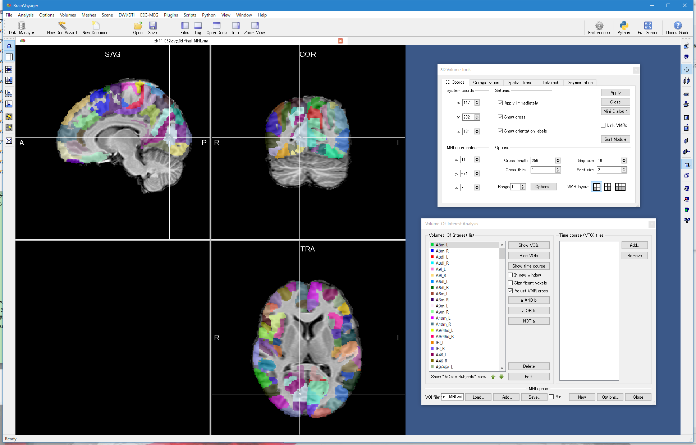

# **README on FS2BV**

<div>Created    : "2010-09-11 18:40:01 ban"</div>
<div>Last Update: "2021-06-14 15:01:32 ban"

**********
# <a name = "Menu"> **Menu** </a>

- [Introduction – what is FS2BV ?](#Introduction)
- [System requirements](#System)
- [How to use FS2BV](#Manual)
  - [Importing FreeSurfer volume, surface, ROIs](#Freesurfer)
  - [The other VOIs (the original ROI files are required to download separately)](#VOIs)
    - [Automated Anatomical Labeling (AAL 1/2/3)](#AAL)
    - [BAA OR](#BAA)
    - [Brainnetome Atlas](#Brainnetome)
    - [Brodmann](#Brodmann)
    - [Buckner JNeurophysiol11 MNI152](#Buckner)
    - [Choi JNeurophysiol12 MNI152](#Choi)
    - [CONN](#CONN)
    - [FreeSurfer autosegmentation](#FSauto)
    - [FSL](#FSL)
    - [MT](#MT)
    - [ProbAtlas v4](#ProbAtlas)
    - [Shenparcel](#ShenParcel)
    - [Spheric VOIs](#Spheric)
    - [Talairach](#Talairach)
  - [The other tools in the toolbox](#Miscs)
- [Acknowledgments](#Acknowledgments)
- [License](#License)
- [Citation of the FS2BV toolbox](#Citation)
- [TODOs](#TODO)

**********

# <a name = "Introduction"> **Introduction – what is FS2BV ?** </a>

The FS2BV toolbox is a collection of **MATLAB** functions for importing FreeSurfer anatomy volumes, cortical surfaces, and ROIs () to BrainVoyager (BrainInnovation, Inc) as VMR, SRF, VOI, POI files (this toolbox is a part of our in-house BrainVoyager extensions. if some files are missing, I will add them to the repository asap). Some SPM/FSL ROI files can be also imported to BrainVoyager using the toolbox. Furthermore, BrainVoyager POIs can be exported as FreeSurfer Annotation files.For more details, please see the comments in each of the functions. Please also see VOI snapshots in ~/FS2BV/images.  

     

**Links**  
Matlab [***The Mathworks*** ](https://www.mathworks.com/)  
FreeSurfer [***FreeSurfer Wiki***](https://surfer.nmr.mgh.harvard.edu/fswiki/FreeSurferWiki)  
BrainVoyager [***BrainInnovation*** ](https://www.brainvoyager.com/)  

[back to the menu](#Menu)

# <a name = "System"> **System requirements** </a>

**OS: Windows, Mac OSX, and Linux**
  - FS2BV works on all three OSs listed above, while it depends on some external utilities or toolboxes below.

**Dependency**
  - UNIX command line tools: some utilitiess like gzip are required to extract *.nii.gz files etc. If you want to use the FS2BV toolbox functions on Windows, please additionally install UNIX command emulator, Cygwin or MSYS2, or a standalone gzip executable etc, and set the envitonmental path to the tools in advance.
  - **BrainVoyager's MATLAB tools, BVQX_tools**: BVQX_tools_08d is recommended. NeuroElf may be compatible but not tested.  
    ref: [**neuroelf**](https://neuroelf.net/)
  - **freesurfer_matlab_tools**: Matlab tools to read/write FreeSurfer files. In this toolbox, a small madified version of the tools is attached.  
    ref: [**FreeSurfer matlab_tools**](https://github.com/freesurfer/freesurfer/tree/dev/matlab)
  - **geom3d**: a library to handle and visualize 3D geometric primitives such as points, lines, planes, polyhedra... It provides low-level functions for manipulating 3D geometric primitives, making easier the development of more complex geometric algorithms.  
    ref: [**geom3d**](https://www.mathworks.com/matlabcentral/fileexchange/24484-geom3d)

[back to the menu](#Menu)

# <a name = "Manual"> **How to use FS2BV** </a>

Please set the MATLAB paths to ~/FS2BV/fs2bv and ~/FS2BV/freesurfer_matlab_tools.  
In importing some ROIs (e.g. FSL ROIs to BrainVoyager), please work in each of the directory in ~/FS2BV/VOIs. A simple script for automatic importing is already prepared in each of the directory.

# <a name = "Freesurfer"> **Importing FreeSurfer volume, surface, ROIs** </a>

To import the ROIs defined outside BrainVoyager, the FS2BV toolbox provides several functions below.  

<pre>
ConvertNiftiRoi2BVvoi_ProbThres     : Converts NII-format ROI probability map to BrainVoayer VOIs
                                      with thresholding the map values
ConvertNiftiRoi2BVvoi_Labels        : Converts NII-format ROI probability map to BrainVoayer VOIs
                                      using the label lookuptable corresponding to the map ID
ExtractFSLroi                       : Extracts specific value(s) from NII based on XML database
ExtractFSLroiDirect                 : Extracts specific value(s) from NII directly for ROI generations
ConvertFSLroi2BVvoi                 : Converts FSL NII ROIs to BrainVoyager VOIs
ConvertSPMroi2BVvoi                 : Converts SPM NII ROIs to BrainVoyager VOIs
ConvertsAALroi2BVvoi                : Converts SPM AAL antomical tempolate (NII) ROIs to BrainVoyager VOIs
ConvertFreeSurferAnnotation2BVpoi   : Converts FreeSurfer surface annotations to BrainVoyager POIs
ConvertFreeSurferParcellation2BVvoi : Converts FreeSurfer MGZ parcellations to BrainVoyager VOIs
ConvertFreeSurferMGZ2VMR            : Converts FreeSurer MGZ T1/ROI files to BrainVoayer VMRs
ConvertFreeSurferRibbon2BL2VMR      : Converts FreeSurfer ribbon.mgz to BrainVoyager *_{LH|RH}_BL2.vmr
ConvertFreeSurferSurf2SRF           : Converts FreeSurer surface files to BrainVoayer SRFs
ImportFreeSurfer2BrainVoyager       : Imports FreeSurfer-processed files into BrainVoyager
MaskVMRbyFreeSurferSegmentation     : for general masking purposes. Any *.mgz segmentation result can be used as a
                                      mask (by default, the parameters are tuned to process wm.seg.mgz as a mask)
MaskVMRbyFreeSurferSegmentation_ribbon: Specific for applying a mask using the white (and gray) matter segmentation
                                      result in ribbon.mgz.
                                      Generally, for surface reconstructions, MaskVMRbyFreeSurferSegmentation_ribbon
                                      gives the better results.
ConvertBVpoi2FreeSurferAnnotation   : Converts BrainVoyager POIs to FreeSurfer Annotation files. We can further
                                      generate label or volume ROI files from the generated annotation files using
                                      FreeSurfer commands.

For searching VOIs in specific XYZ coords in TAL/MNI, please use
GetAreaNameFromAtlasVOI             : Returns area candidates, in which the input XYZ coordinate(s)
                                      is(are) belonging to, based on the pre-defined VOI atlases.
</pre>

In these functions, for importing the FreeSurfer-preprocessed files into BrainVoyager, the wrapper function, **ImportFreeSurfer2BrainVoyager**, is prepared which makes all the file imports fully automatic.  
The **ImportFreeSurfer2BrainVoyager** function especially uses  
1. **ConvertFreeSurferMGZ2VMR** for importing anatomy and auto segmentation files as VMRs  
2. **ConvertFreeSurferSurf2SRF** for importing surface files as SRFs  
3. **ConvertFreeSurferParcellation2BVvoi** for importing volume ROI files as VOIs  
4. **ConvertFreeSurferAnnotation2BVpoi** for importing surface ROI files as POIs  
So please just call the function on MATLAB shell.  

**usage**

```Matlab
function ImportFreeSurfer2BrainVoyager(fs_subj_dir,:do_flg)
(: is optinal)
```

**Example**

```Matlab
>> fs_subj_dir='./freesurfer/subjects/DC';
>> do_flg=ones(1,5); % run all the importing procedures
>> ImportFreeSurfer2BrainVoyager(fs_subj_dir,do_flg);
```

**input**

<pre>
fs_subj_dir : FreeSurfer subject directory with a relative path format, in which
              the origin of the path is the location where this function is called.
              e.g. ../subjects/DC
do_flg      : (optional) a [1 x 5] matrix. flags to decide whether running the
              importing step listed below.
              step 01: importing FreeSurfer anatomy files
              step 02: importing FreeSurfer volume ROI files
              step 03: importing FreeSurfer surface files
              step 04: importing FreeSurfer surface ROI files
              step 05: adding subject name prefix (e.g. HB_) at the head of each of files.
              if each flag is set to 1, the importing procedure correspond to that step
              is run. If some of the flags are set to 0, the corresponding procure(s)
              will be skipped.
              do_flg=[1,1,1,1,1]; by default.
</pre>  

**output**

<pre>
no output variable
generated BrainVoyager-format files are stored in fs_subj_dir as
fs_subj_dir/BrainVoyager/(subj_name)/{vmr|srf|voi|poi}/*.{vmr|srf|voi|poi}
</pre>

[back to the menu](#Menu)

# <a name = "VOIs"> **The other VOIs (the original ROI files are required to download separately)** </a>

The FS2BV toolbox can also import the other ROI files defined for SPM and FSL into BrainVoyager. For importing, you can use one of  

<pre>
- ConvertNiftiRoi2BVvoi_ProbThres
- ConvertNiftiRoi2BVvoi_Labels
- ExtractFSLroi
- ExtractFSLroiDirect
- ConvertFSLroi2BVvoi
- ConvertSPMroi2BVvoi
- ConvertsAALroi2BVvoi
</pre>

**ROIs that can be imported to BrainVoyager and auto-conversion scripts**
Importing the ROI files listed below were already tested. For details, please see the contents ~/FS2BV/VOIs directory. In each of the subdirectories, simple script for the conversion is already stored. The original ROI files (e.g. *.nii) have to be downloaded by yourself from the links below.  

# <a name = "AAL"> Automated Anatomical Labeling (AAL 1/2/3) </a>

<pre>
  about : SPM AAL/AAL2/AAL3 templates
  ref   : https://www.gin.cnrs.fr/en/tools/aal/
  script: ~/FS2BV/VOIs/automated_anatomical_labeling_VOIs/aal/script_convert_AALnii2VOI.m
          ~/FS2BV/VOIs/automated_anatomical_labeling_VOIs/aal2/script_convert_AALnii2VOI.m
          ~/FS2BV/VOIs/automated_anatomical_labeling_VOIs/aal3/script_convert_AAL3nii2VOI.m
</pre>

  

[back to the menu](#Menu)

# <a name = "BAA"> BAA OR </a>

<pre>
  about : Activity atlas for object recognition
  ref   : http://www.brainactivityatlas.org/atlas/atlas-download/
  script: ~/FS2BV/VOIs/BAA_OR_VOIs/script_convert_BAAOAnii2VOI.m
</pre>

  

[back to the menu](#Menu)

# <a name = "Brainnetome"> Brainnetome Atlas </a>

<pre>
  about : Brainnetome Atlas
  ref   : http://atlas.brainnetome.org/index.html
  script: ~/FS2BV/VOIs/Brainnetome_Atlas_VOIs/script_convert_nii2voi
</pre>

  

[back to the menu](#Menu)

# <a name = "Brodmann"> Brodmann Atlas </a>

<pre>
  about : Brodmann 48 Area Atlas, extracted from MRIcron
  ref   : http://people.cas.sc.edu/rorden/mricron/index.html
          http://www.cabiatl.com/mricro/mricro/template.html
  script: ~/FS2BV/VOIs/brodmann_VOIs/script_convert_BrodmannNII2VOIs.m
</pre>

  

[back to the menu](#Menu)

# <a name = "Buckner"> Buckner JNeurophysiol11 MNI152 </a>

<pre>
  about : Cerebellum parcellation estimated by intrinsic functional connectivity
  ref   : https://surfer.nmr.mgh.harvard.edu/fswiki/CerebellumParcellation_Buckner2011
  script: ~/FS2BV/VOIs/Buckner_JNeurophysiol11_MNI152_VOIs/script_convert_nii2voi.m
</pre>

  

[back to the menu](#Menu)

# <a name = "Choi"> Choi JNeurophysiol12 MNI152 </a>

<pre>
  about : Striatum parcellation estimated by intrinsic functional connectivity
  ref   : http://surfer.nmr.mgh.harvard.edu/fswiki/StriatumParcellation_Choi2012
  script: ~/FS2BV/VOIs/Choi_JNeurophysiol12_MNI152_VOIs/script_convert_nii2voi.m
</pre>

  

[back to the menu](#Menu)

# <a name = "CONN"> CONN </a>

<pre>
  about : Atlas for cortical network/connectivity analysis
  ref   : https://web.conn-toolbox.org/
  script: ~/FS2BV/VOIs/CONN/script_convert_atlas_NII2VOIs.m
          ~/FS2BV/VOIs/CONN/script_convert_Brodmann_NII2VOIs.m
          ~/FS2BV/VOIs/CONN/script_convert_networks_NII2VOIs.m
</pre>

  
  
  

[back to the menu](#Menu)

# <a name = "FSauto"> FreeSurfer autosegmentation </a>

<pre>
  about : FreeSurfer individual cortex parcellation
  ref   : https://surfer.nmr.mgh.harvard.edu/
  script: please use **ImportFreeSurfer2BrainVoyager** (please see the description above)
</pre>

  
  

[back to the menu](#Menu)

# <a name = "FSL"> FSL Atlas </a>

<pre>
  about : Templates and atlases included with FSL
  ref   : https://fsl.fmrib.ox.ac.uk/fsl/fslwiki/Atlases
  script: ~/FS2BV/VOIs/FSL_atlases_VOIs/script_FSL_ROI_conversion.m
          please also see README.txt
</pre>

  

[back to the menu](#Menu)

# <a name = "MT"> MT Atlas </a>

<pre>
  about : Probabilistic hMT+ atlas
  ref   : http://www.brainactivityatlas.org/atlas/atlas-download/
  script: ~/FS2BV/VOIs/MT_atlases_VOIs/script_convert_MTnii2VOI.m
</pre>

  

[back to the menu](#Menu)

# <a name = "ProbAtlas"> ProbAtlas v4 </a>

<pre>
  about : Probabilistic Maps of Visual Topography in Human Cortex
  ref   : http://scholar.princeton.edu/napl/resources
  script: ~/FS2BV/VOIs/ProbAtlas_v4_VOIs/script_convert_Wang_maxprob_ROIs2VOIs.m
          ~/FS2BV/VOIs/ProbAtlas_v4_VOIs/script_convert_Wang_probability_ROIs2VOIs.m
</pre>

  

[back to the menu](#Menu)

# <a name = "Shenparcel"> Shenparcel </a>

<pre>
  about : Functional Brain Atlas from Finn/Shen et al Nature Neuro 2015, from NeuroElf package.
  ref   : https://www.nitrc.org/frs/?group_id=51
          http://neuroelf.net/
  script: ~/FS2BV/VOIs/shenparcel_VOIs/script_convert_TAL2MNI_VOI.m
</pre>

  

[back to the menu](#Menu)

# <a name = "Spheric"> Spheric VOIs </a>

<pre>
  about : Examples on how to make spherical VOIs whose centers are located on specific TAL/MNI coords
  ref   : no reference
  script: ~/FS2BV/VOIs/Spheric_VOIs/script_generate_MNI_VOIs.m
          ~/FS2BV/VOIs/Spheric_VOIs/script_generate_TAL_VOIs.m
</pre>

  

[back to the menu](#Menu)

# <a name = "Talairach"> Talairach.org </a>

<pre>
  about : Official Talairach segmentation. Talairach.nii is a NIfTI image that contains the Talairach label data
  ref   : http://www.talairach.org/
  script: ~/FS2BV/VOIs/Talairach.org_VOIs/script_convert_NII2VOI.m
</pre>

  

[back to the menu](#Menu)

# <a name = "Yeo"> Yeo JNeurophysiol11 MNI152 </a>

<pre>
  about : Cortical Parcellation Estimated by Intrinsic Functional Connectivity
  ref   : http://surfer.nmr.mgh.harvard.edu/fswiki/CorticalParcellation_Yeo2011
  script: ~/FS2BV/VOIs/Yeo_JNeurophysiol11_MNI152_VOIs/script_convert_nii2voi.m
</pre>

  

[back to the menu](#Menu)

# <a name = "Miscs"> **The other tools in the toolbox** </a>


[back to the menu](#Menu)

# <a name = "Acknowledgments"> **Acknowledgments** </a>

The FS2BV toolbox were developed to import ROIs defined for FreeSurfer/SPM/FSL on BrainVoyager to compare our fMRI results with the other studies.  
We would like to express our deepest gratitude to all the researchers who made their own findings as the ROIs available to the public free of charge.
Also, the core of the tool were built on the great MATLAB tool to handle BrainVoyager data, BVQX_tools. For details, please see the links below. We also express our gratitude to the developers of the tool.

   **BVQX_tools (now NeuroElf)** : MATLAB tools for handling BrainVoyager files and datasets  

   NeurElf website: [https://neuroelf.net/](https://neuroelf.net/)  
   BVQX_tools release note: [https://support.brainvoyager.com/brainvoyager/available-tools/88-matlab-tools-bvxqtools/361-release-notes-neuroelf-bvqxtools](https://support.brainvoyager.com/brainvoyager/available-tools/88-matlab-tools-bvxqtools/361-release-notes-neuroelf-bvqxtools)  
   BVQX_tools history: [https://support.brainvoyager.com/brainvoyager/available-tools/88-matlab-tools-bvxqtools/362-history-of-neuroelf-bvqxtools](https://support.brainvoyager.com/brainvoyager/available-tools/88-matlab-tools-bvxqtools/362-history-of-neuroelf-bvqxtools)

[back to the menu](#Menu)

# <a name = "License"> **License** </a>

FS2BV --- MATLAB tools for importing FreeSurfer anatomy volumes and cortical surfaces, and FreeSurfer/SPM/FSL ROIs into BrainVoyager  
Copyright (c) 2021, Hiroshi Ban, All rights reserved.  

Redistribution and use in source and binary forms, with or without modification, are permitted provided that the following conditions are met:

    * Redistributions of source code must retain the above copyright
      notice, this list of conditions and the following disclaimer.
    * Redistributions in binary form must reproduce the above copyright
      notice, this list of conditions and the following disclaimer in
      the documentation and/or other materials provided with the distribution

THIS SOFTWARE IS PROVIDED BY THE COPYRIGHT HOLDERS AND CONTRIBUTORS "AS IS" AND ANY EXPRESS OR IMPLIED WARRANTIES, INCLUDING, BUT NOT LIMITED TO, THE IMPLIED WARRANTIES OF MERCHANTABILITY AND FITNESS FOR A PARTICULAR PURPOSE ARE DISCLAIMED. IN NO EVENT SHALL THE COPYRIGHT OWNER OR CONTRIBUTORS BE LIABLE FOR ANY DIRECT, INDIRECT, INCIDENTAL, SPECIAL, EXEMPLARY, OR CONSEQUENTIAL DAMAGES (INCLUDING, BUT NOT LIMITED TO, PROCUREMENT OF SUBSTITUTE GOODS OR SERVICES; LOSS OF USE, DATA, OR PROFITS; OR BUSINESS INTERRUPTION) HOWEVER CAUSED AND ON ANY THEORY OF LIABILITY, WHETHER IN CONTRACT, STRICT LIABILITY, OR TORT (INCLUDING NEGLIGENCE OR OTHERWISE) ARISING IN ANY WAY OUT OF THE USE OF THIS SOFTWARE, EVEN IF ADVISED OF THE POSSIBILITY OF SUCH DAMAGE.

[back to the menu](#Menu)

# <a name = "Citation"> **Citation of the FS2BV toolbox** </a>

<br></br>
**IMPORTANT: If you use some of the imported VOIs in your studies, please cite the original authors' papers and the software packages rather than citing the FS2BV tool.**  
<br></br>
Even after that, if you still have some space in your reference section, please cite this GitHub repository like,  

**FS2BV toolbox: [https://github.com/hiroshiban/FS2BV](https://github.com/hiroshiban/FS2BV)**  
**by Hiroshi Ban**  

If you have no space, please cite it somewhere someday next time. Thank you so much.

[back to the menu](#Menu)

# <a name = "TODO"> **TODOs** </a>

1. Adding some more converstion scripts.
2. Compiling *.m files using the MATLAB compiler so that we can provide a standalone verion of the FS2BV package.
3. Make the tool be compatible with NeuroElf as well as BVQX_tools.

[back to the menu](#Menu)
